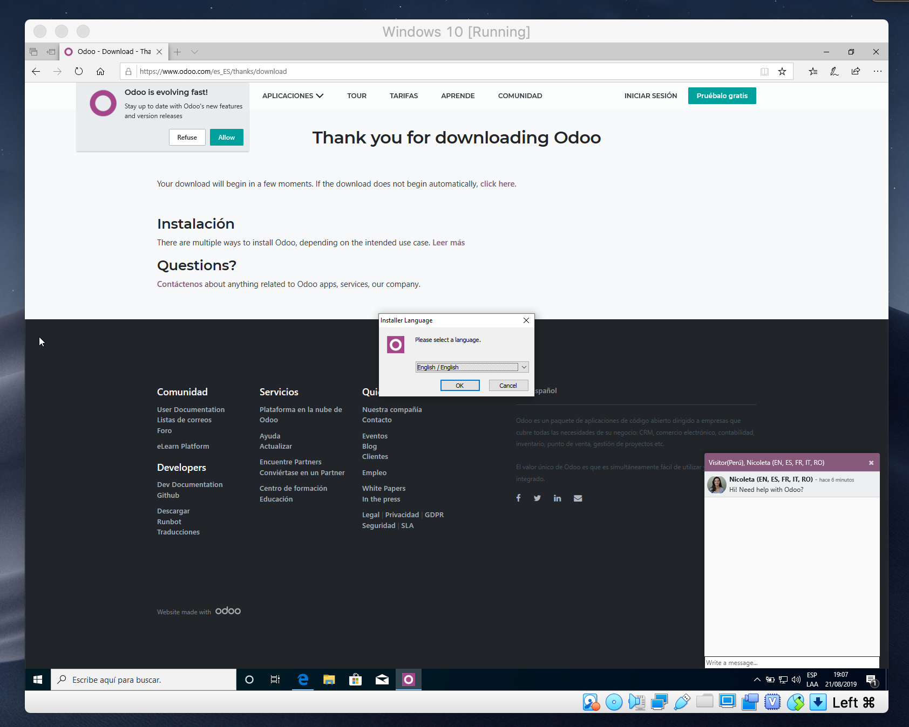
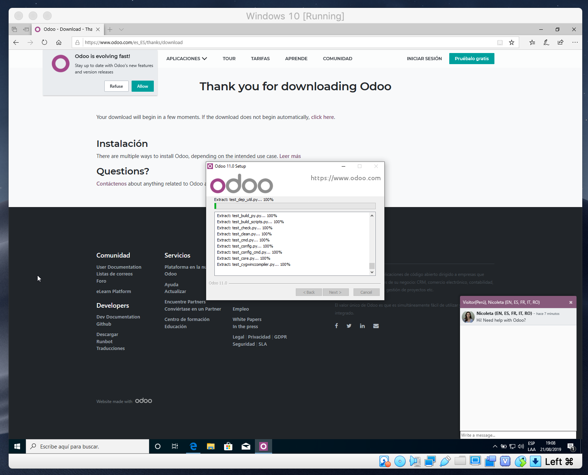
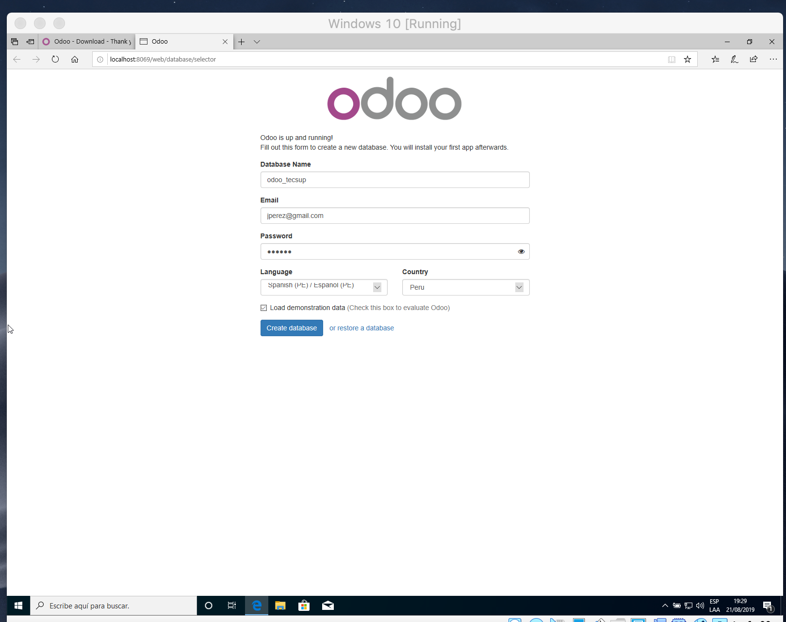
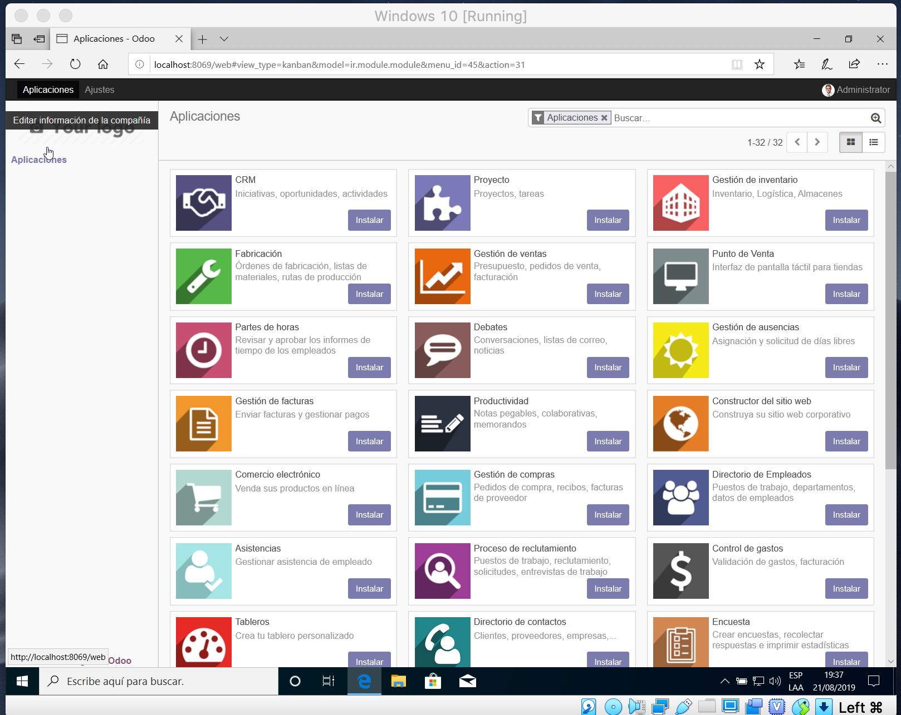
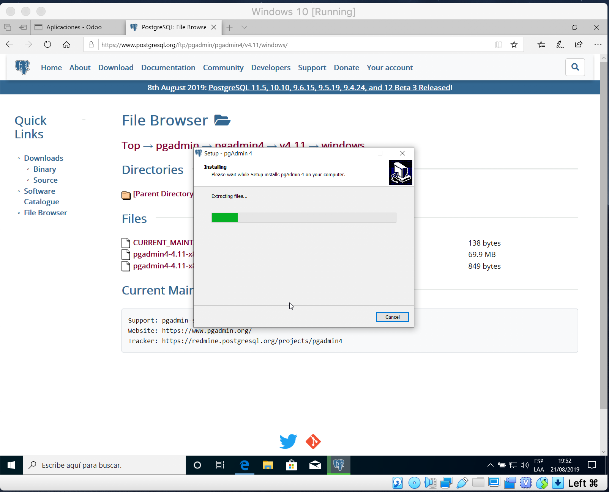
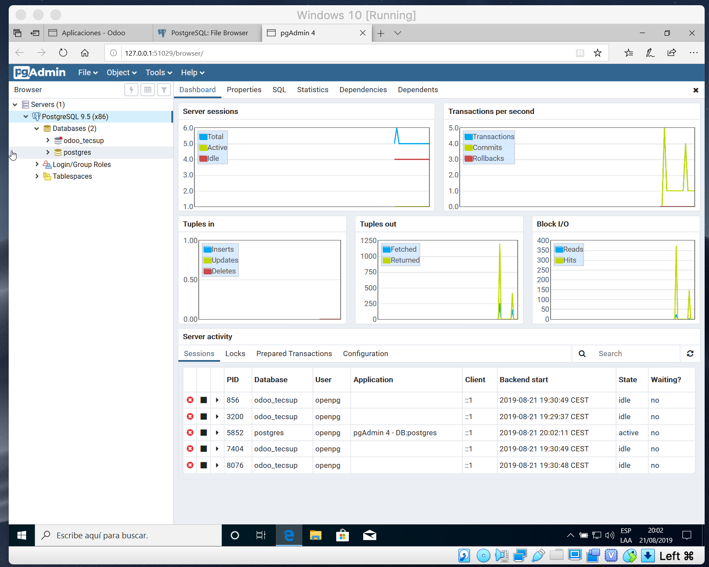
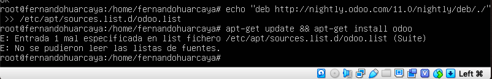

# Lab. 1: Instalación de ODOO.

1. Se inicia el proceso de instalación de Odoo.
   

2. Esperamos a que termine de instalar Odoo.
   

3. Una vez terminada la instalación se inicia Odoo en un localhost así pudiendo poner los datos para crear la base de datos para instalar nuestra primera app.
   

4. Aquí podemos observar las apps que están disponibles en Odoo.
   

5. Instalamos **PgAdmin** para poder ver el estado de la base de datos.
   

6. Podemos observar que si fue creda nuestra base de datos y ver unos gráficos de datos.
   

## Conclusiones

- No se pudo completar la instalación en Linux ya que presentamos problemas al poner un código, adjunto imagen de error.
  
- Odoo es un software muy provechoso ya que es de código abierto y sirve para gestionar cualquier empresa.
