# Lab. 2: Administración de Módulos ODOO

1. Se puede ver todas las aplicaciones que tenemos hasta el momento.
   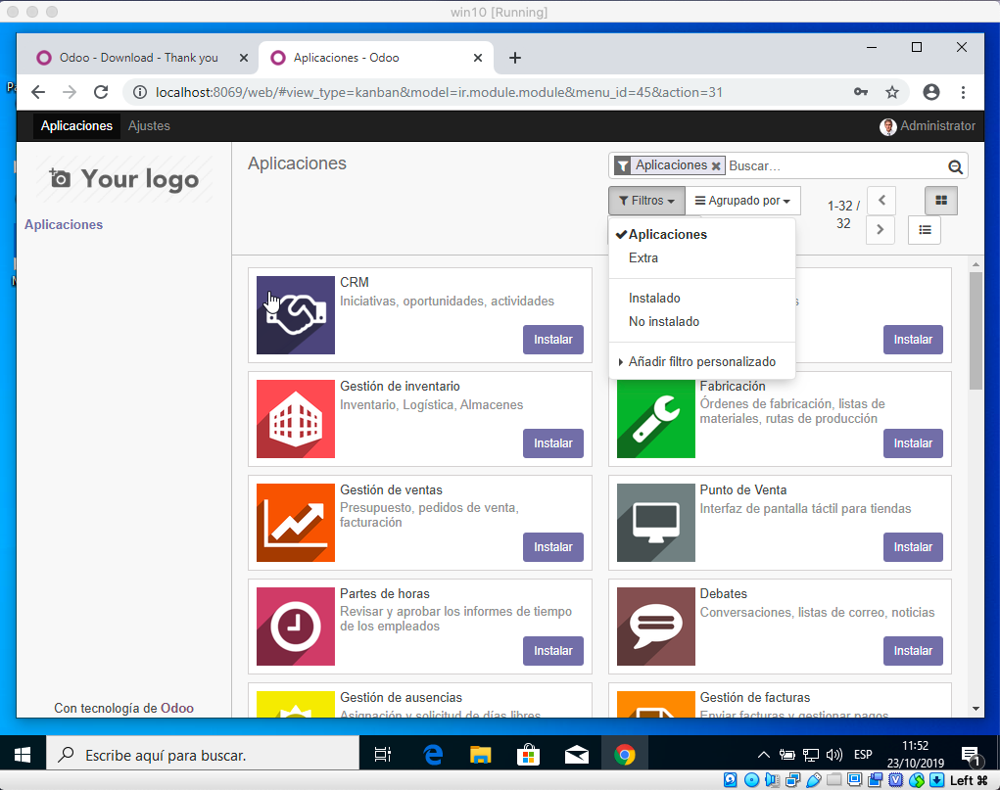

2. Se observa todo lo instalado hasta el momento.
   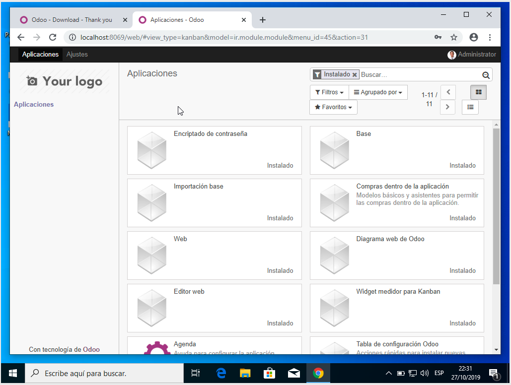

3. Se observa el filtro de "no instalado", muestra sugerencias a instalar.
   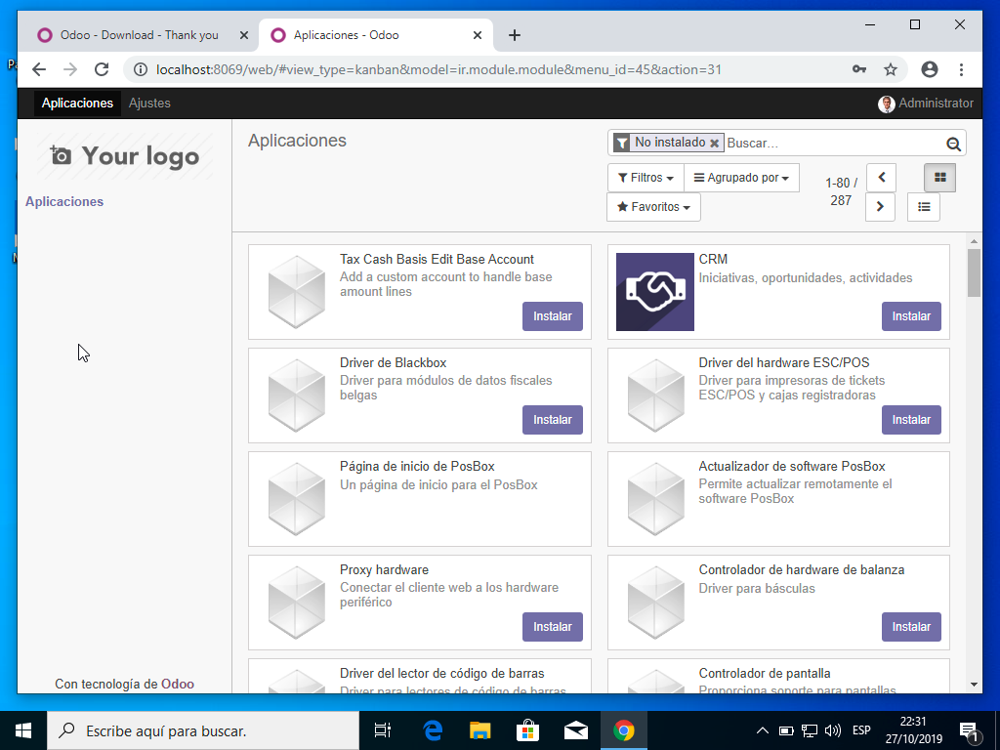

4. Se hizo la búsqueda de "Proyecto" en módulos.
   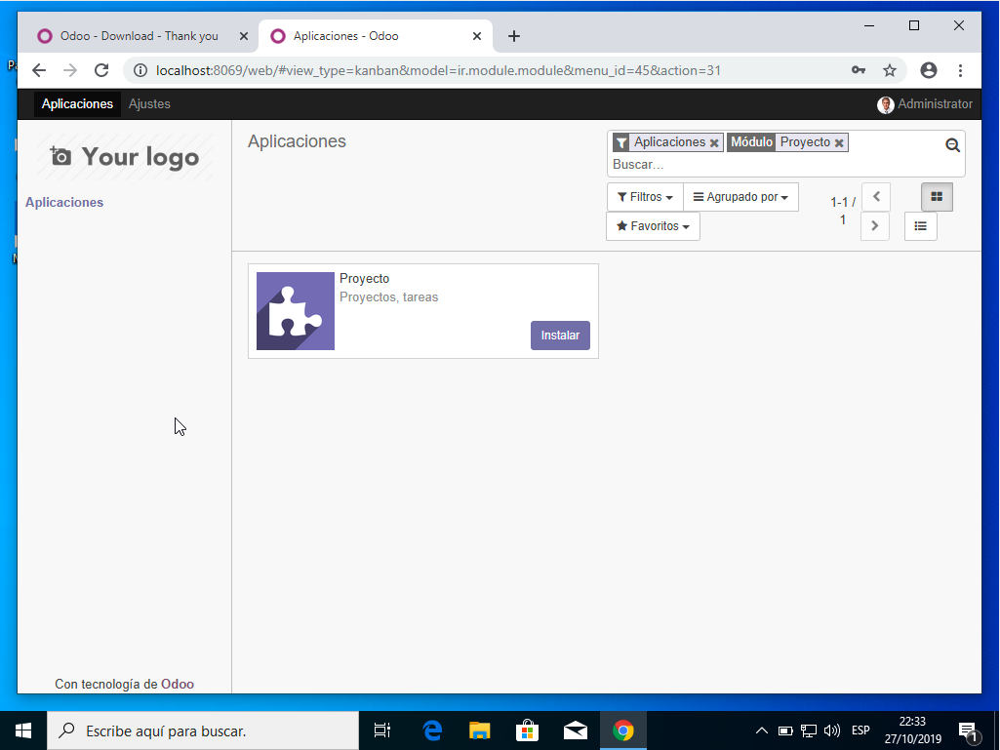

5. Pantalla de carga del progreso de instalación de "Proyecto".
   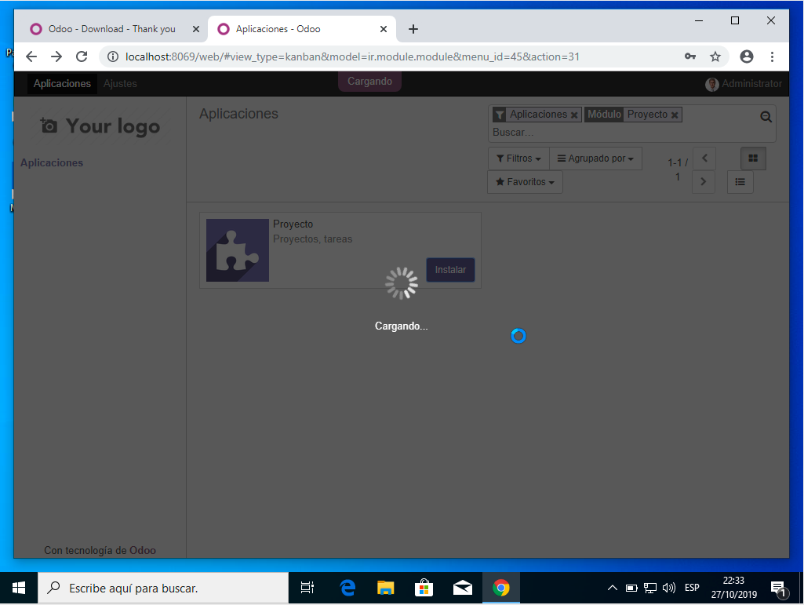

6. Se puede observar las aplicaciones instaladas correctamente.
   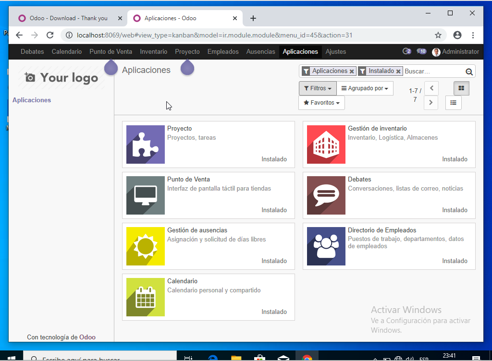

7. Nombre de los tableros mostrados en el laboratorio.
   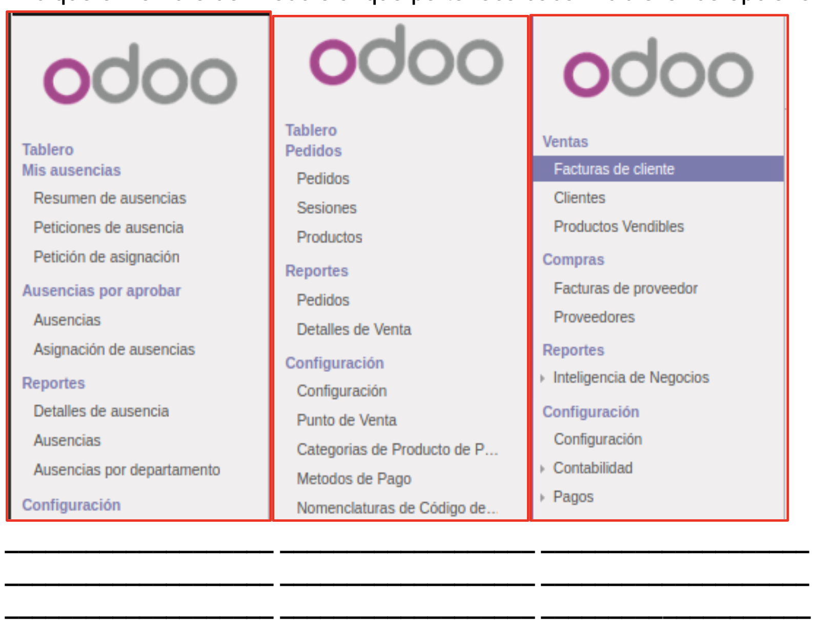

8. Se activa el modo desarrolador.
   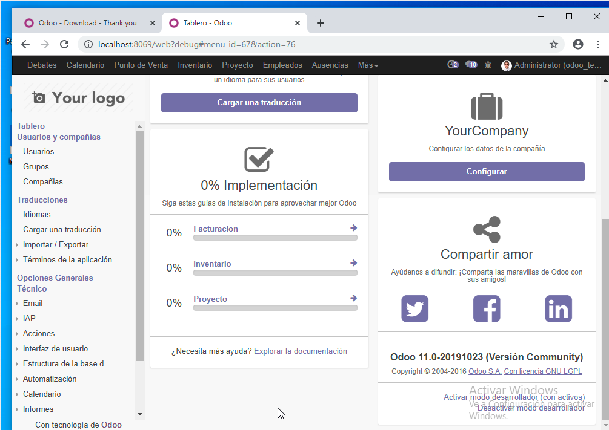

9. Se ingresa a la carpeta server con el comando:

```bash
cd C:\Program Files (x86)\Odoo 11.0\server
```

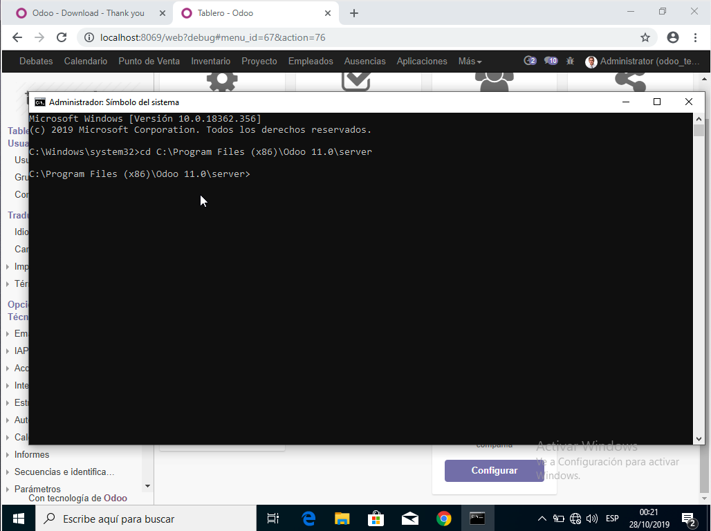

10. Se observa los archivos de la carpeta **testmodulo1**.
    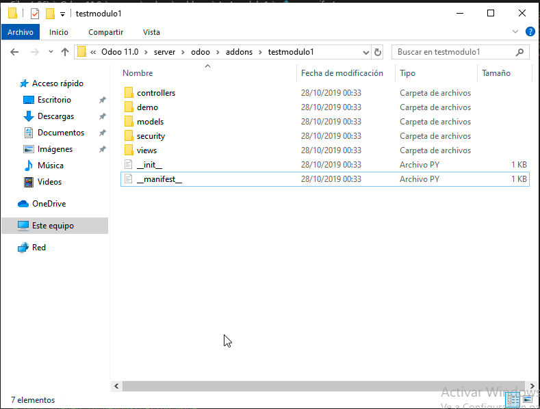

11. Se observa el contenido del archivo ****manifest**.py**.
    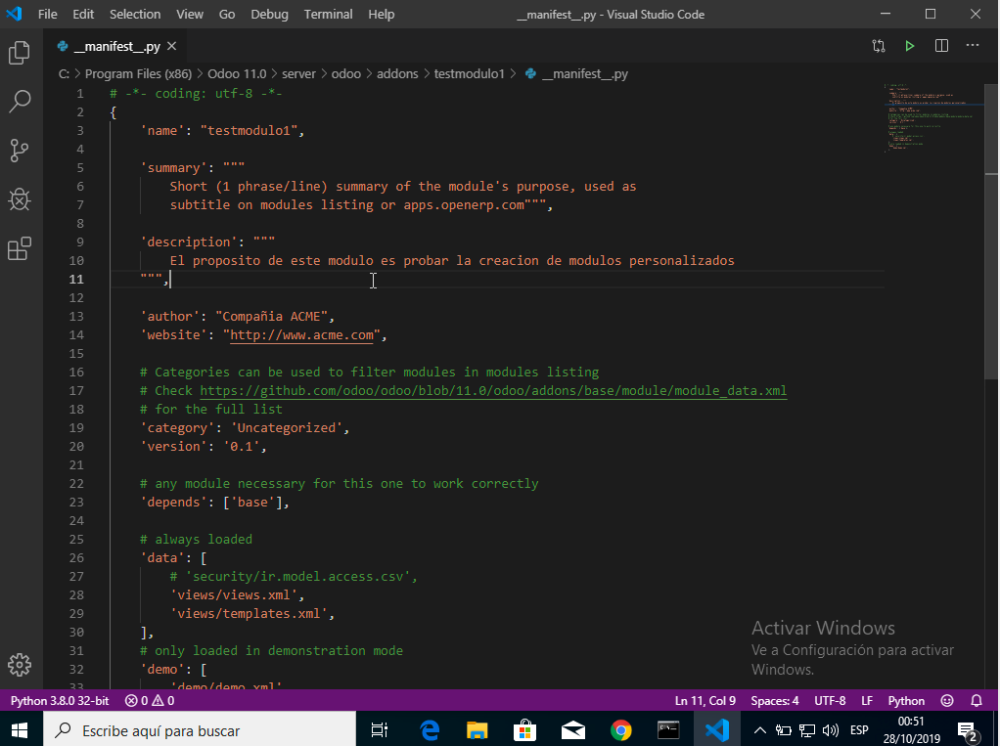

12. Podemos ver el módulo creado en las aplicaciones de Odoo.
    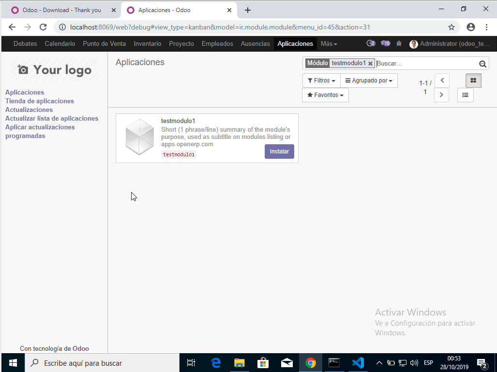

13. Podemos ver que el módulo **testmodulo1** está instalado conrrectamente y los cambios realizados en el archivo ****manifest**.py** si fueron realizados correctamente.
    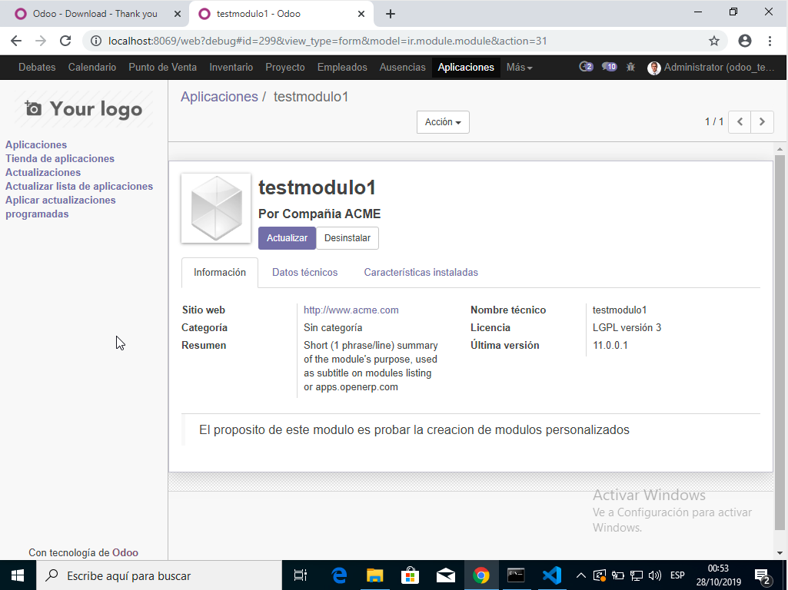
