## Lab. 4: Logística

1. Ventana principal de **Inventario**.
   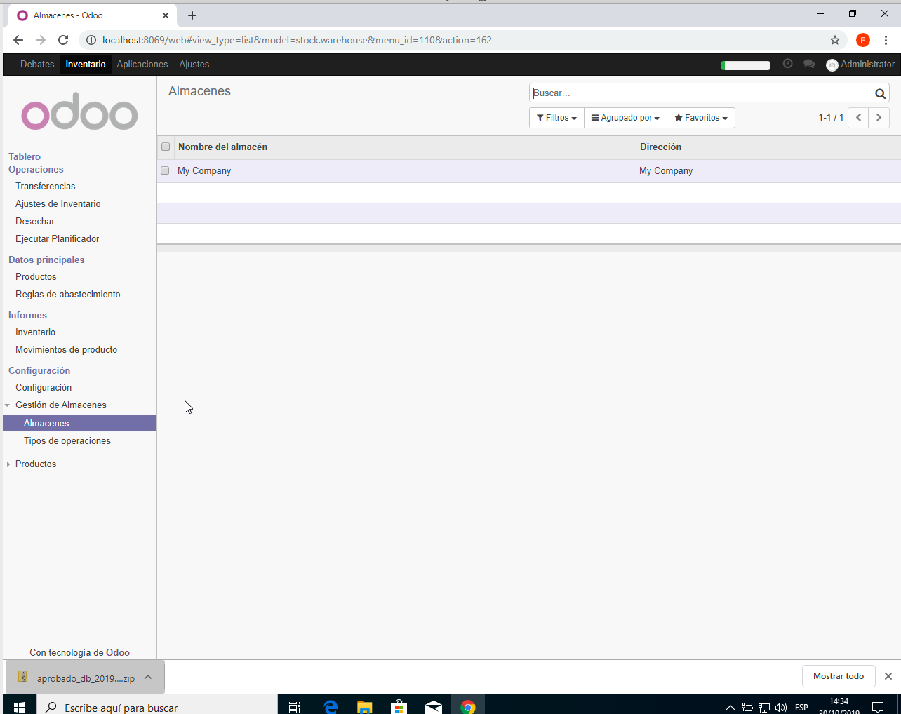

2. Almacen Secundario creado con éxito.
   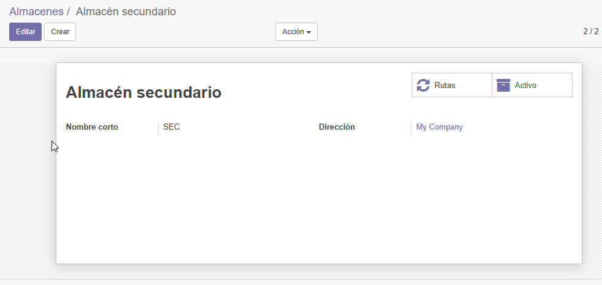

3. Creación de Producto.
   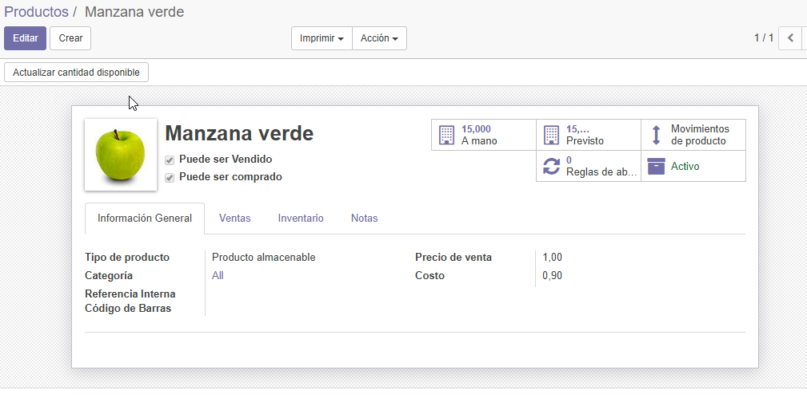

4. Vemos el stock disponible en almacén principal y secundario.
   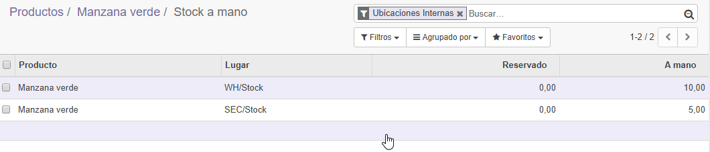

5. Exportando datos en excel para poder agregar masivamente.
   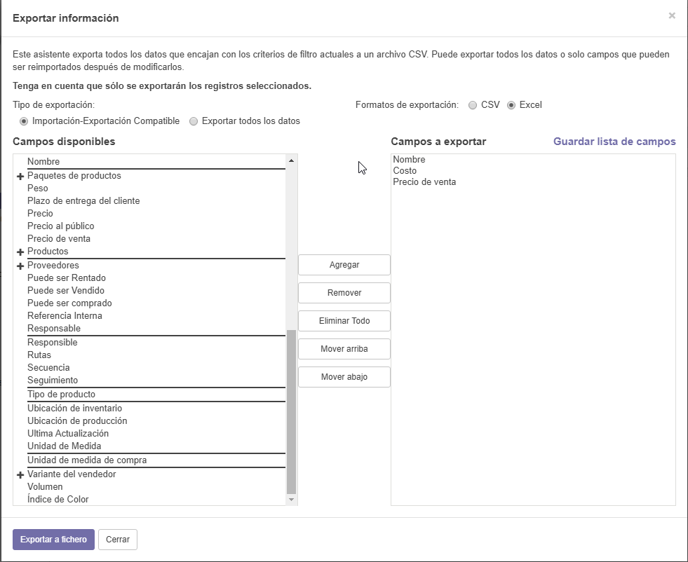

6. Configurando archivo excel para agregar datos masivamente.
   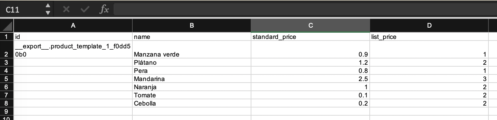

7. Comprobando la subida de datos según el excel cargado.
   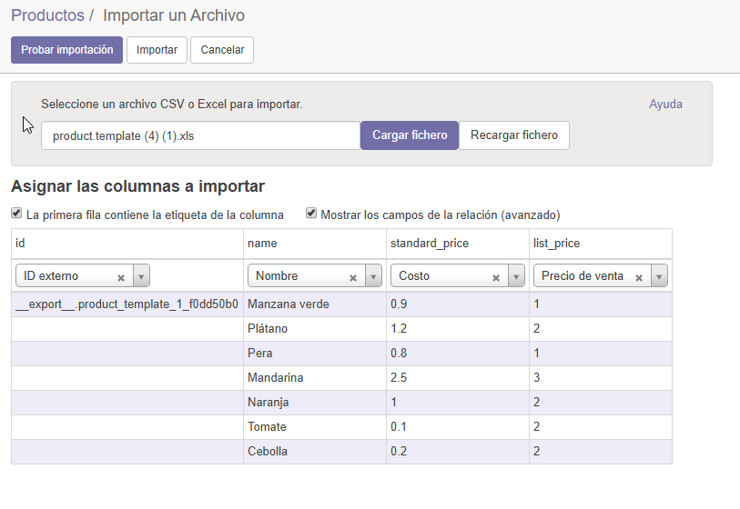

8. Datos subidos correctamente.
   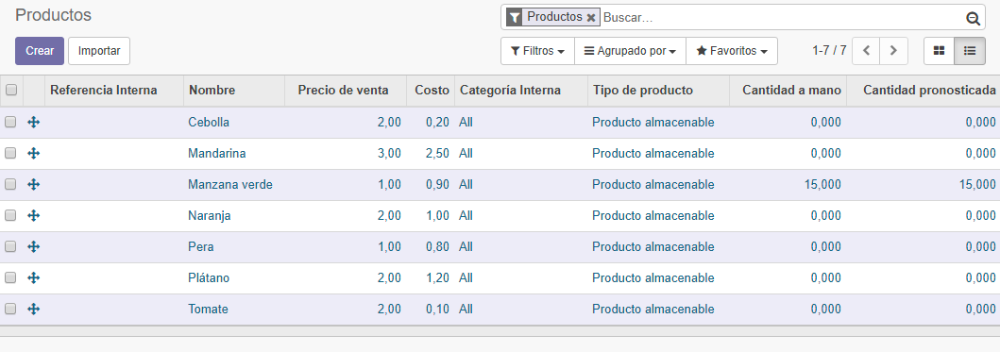

9. Creamos inventario inicial para poder modificar la cantidad rápidamente.
   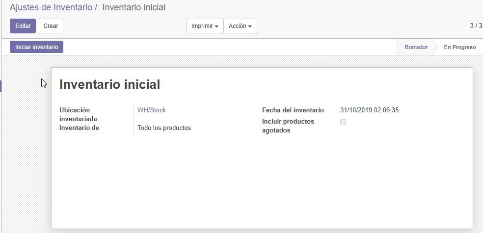

10. Agregamos los detalles del inventario.
    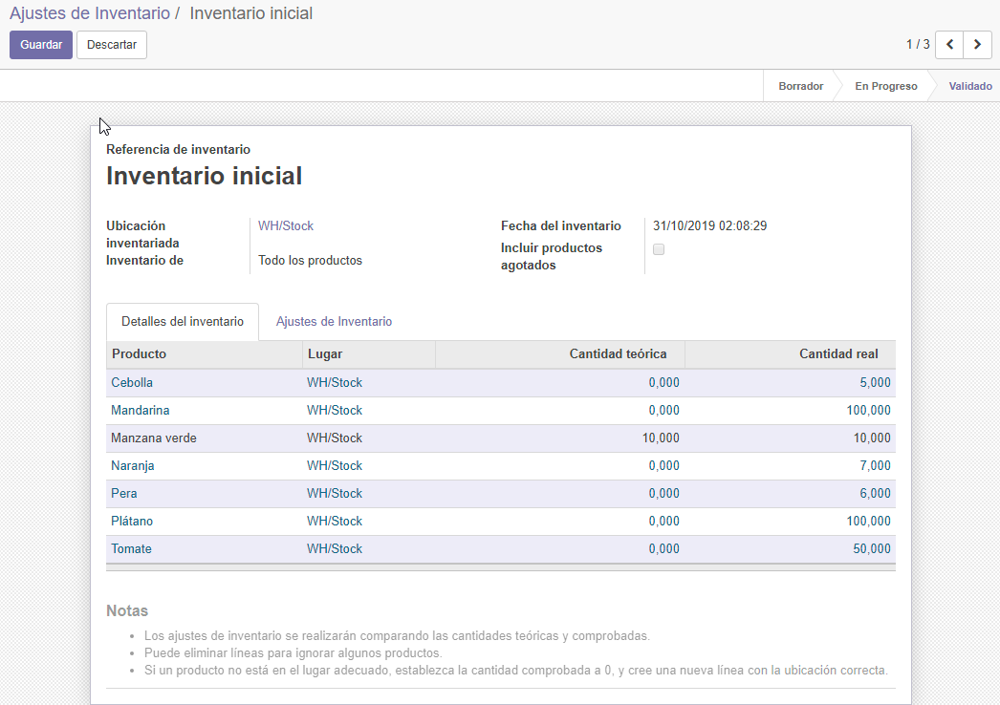

11. Creamos una transferencia interna.
    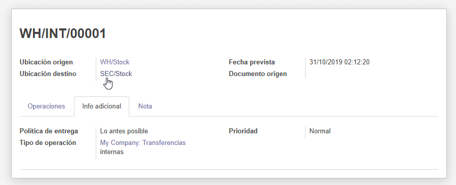

12. Verificamos si se hizo la transferencia al almacén secundario.
    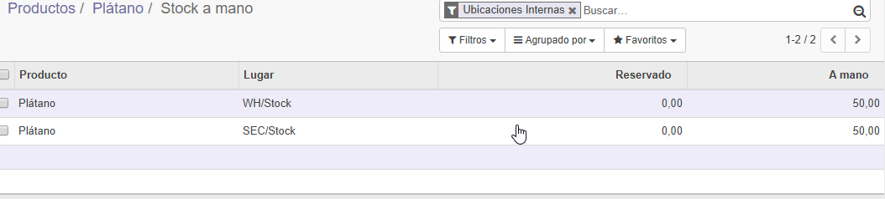

13. Creamos una regla de abastecimiento que en si hace que cuando un producto llega al mínimo verificará con lo que tengamos en el inventario para pedir lo que falta.
    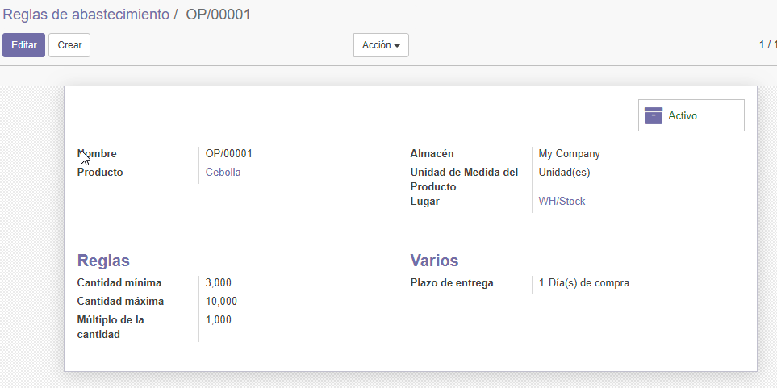
