# Lab. 5: Módulo ventas.

1. Pantalla principal de Ventas.
   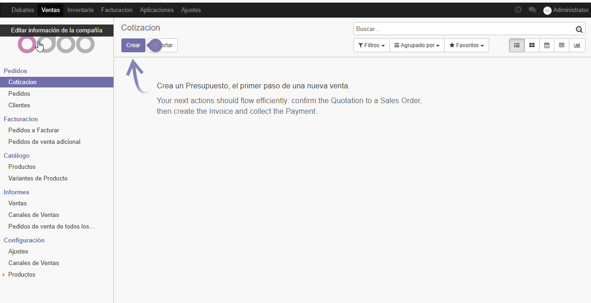

2. Creación de Cotización.
   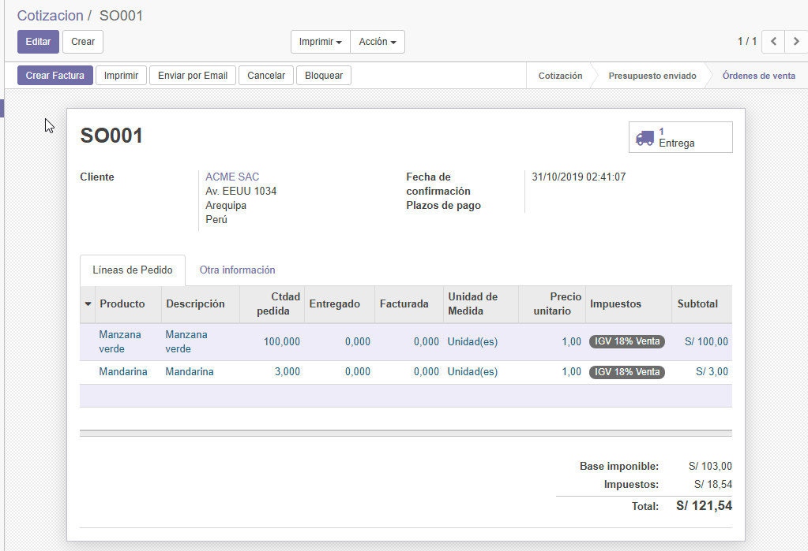

3. Nueva orden de entrega generada.
   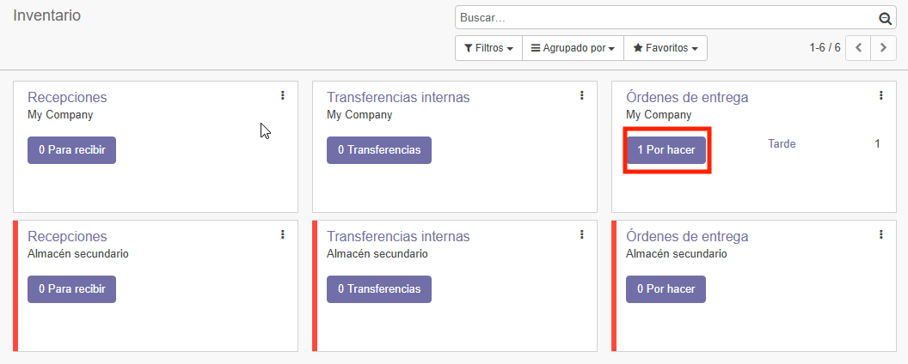

4. Orden de entrega ya realizada.
   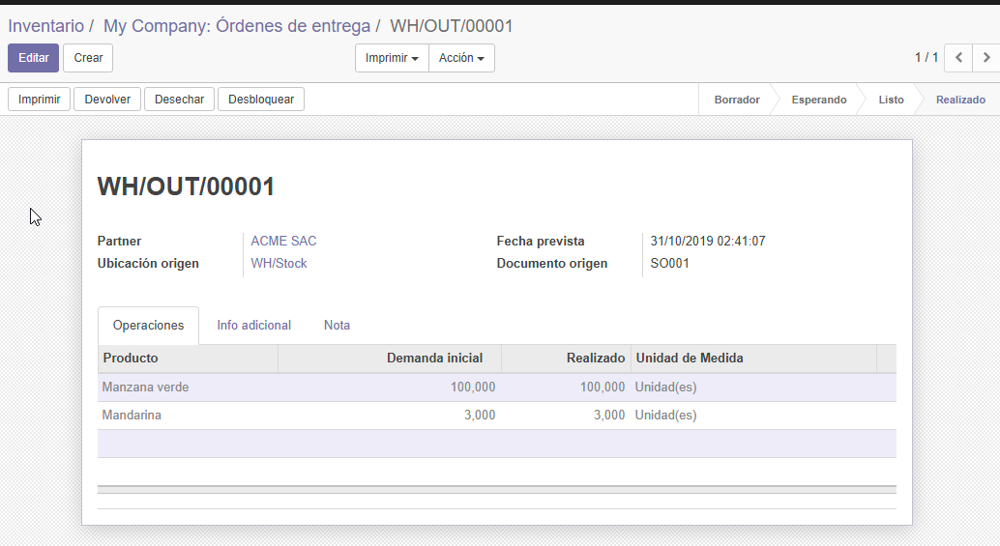

5. Orden de entrega cuando pomenos imprimir.
   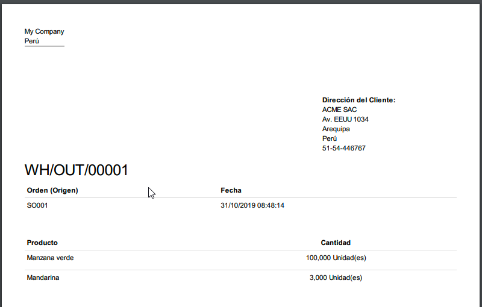

6. Vista e como se ve al enviar factura por correo al cliente.
   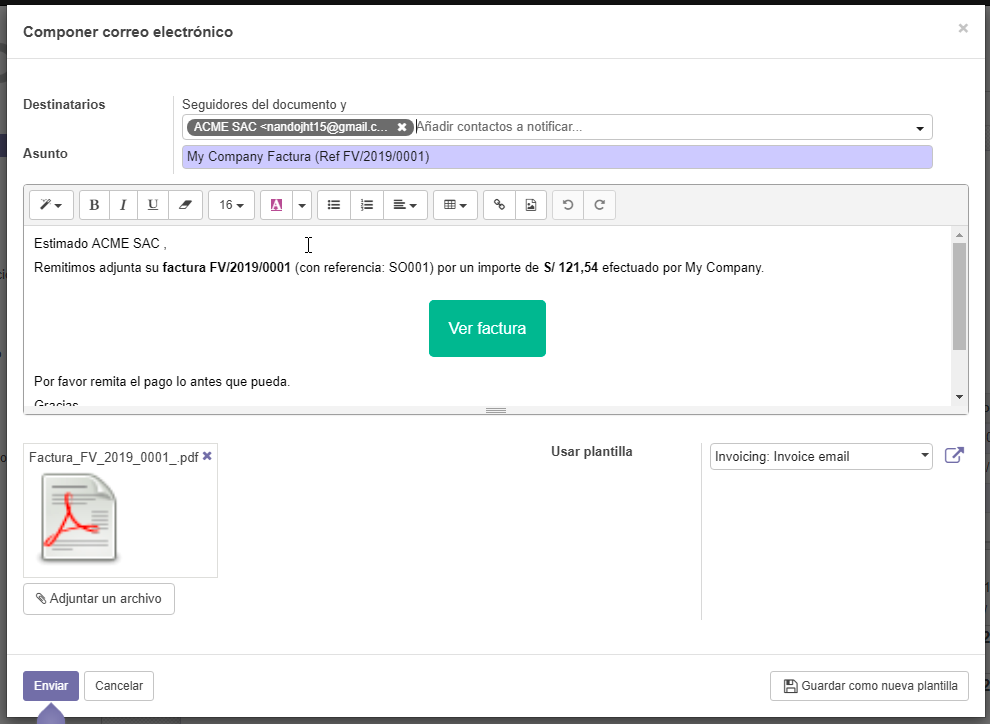

7. Cliente con indicador de cuantas ventas tiene.
   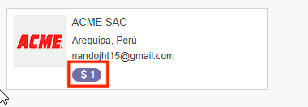

8. Podemos ver aquí que hicimos un pago parcial y se refleja en la factura.
   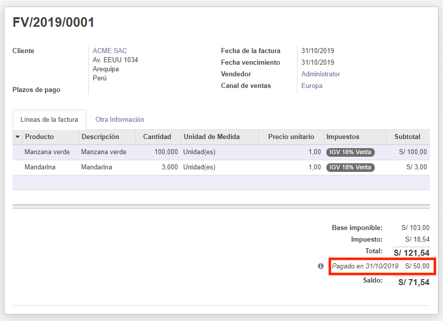

9. Vemos como llegó el correo exitosamente a nuestro cliente.
   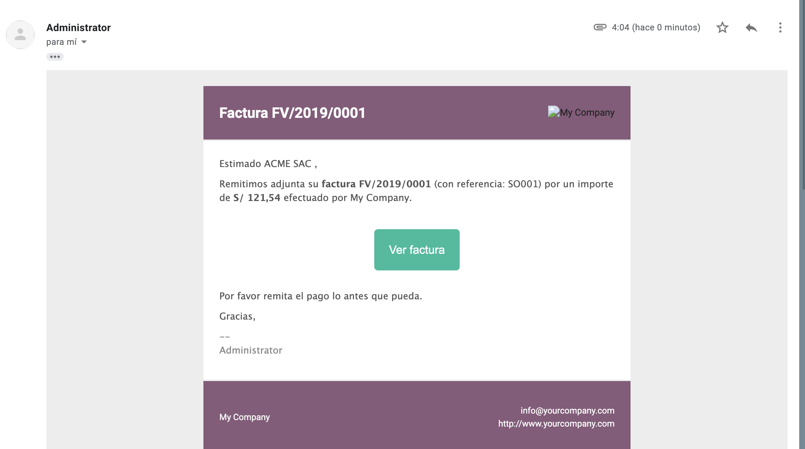

10. Configuración de secuencia de sales order.
    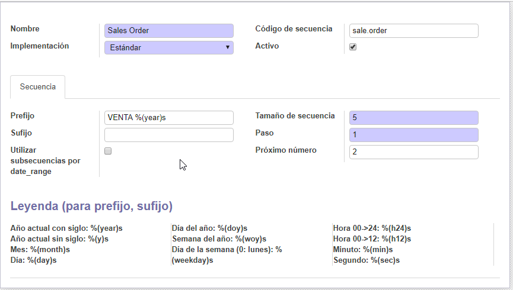

11. Verificamos cambios al realizar la configuración de secuencia, eso se ve reflejado en **VENTA 20190002**
    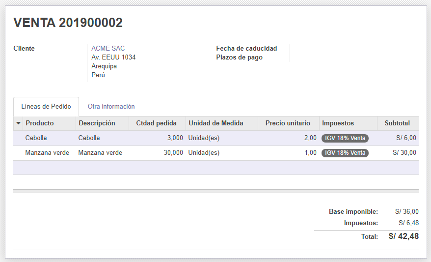

12. Verificación de que fue creada **Tarifa Mayoristas**
    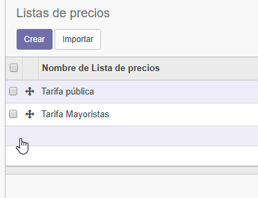

13. Verificando la lista de precios de manzana para cada uno.
    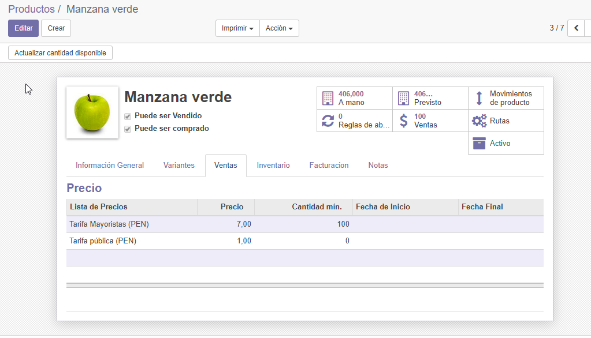

14. Dando acceso a un contacto.
    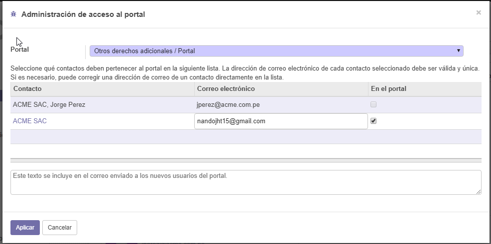

15. Correo de acceso al contacto seleccionado.
    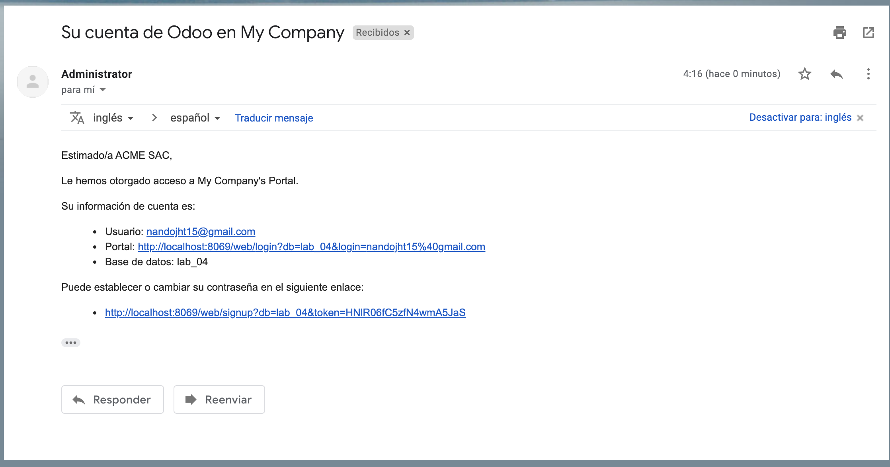

16. Ingresando al link enviado al contacto y creando sus credenciales.
    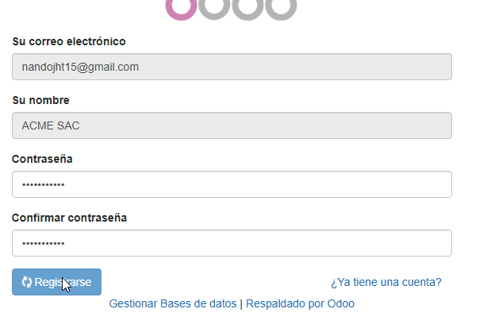

17. Vista del invitado **pedidos**
    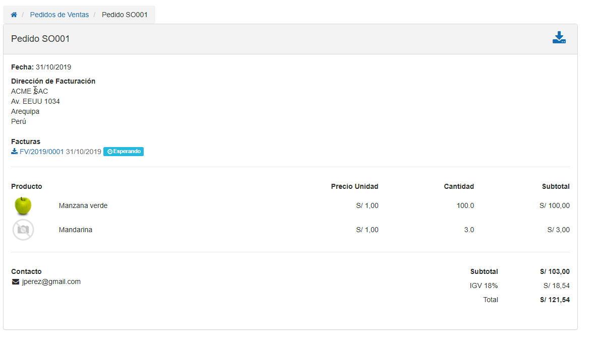

18. Vista de modificación de datos del contacto invitado.
    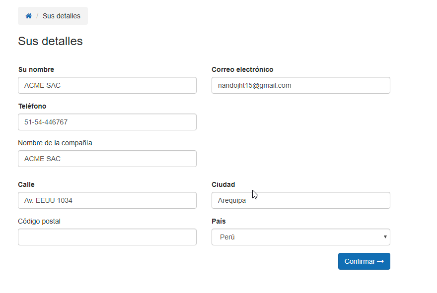
