# Lab. 6: Módulo Compras

1. Solicitud de presupuesto generado.
   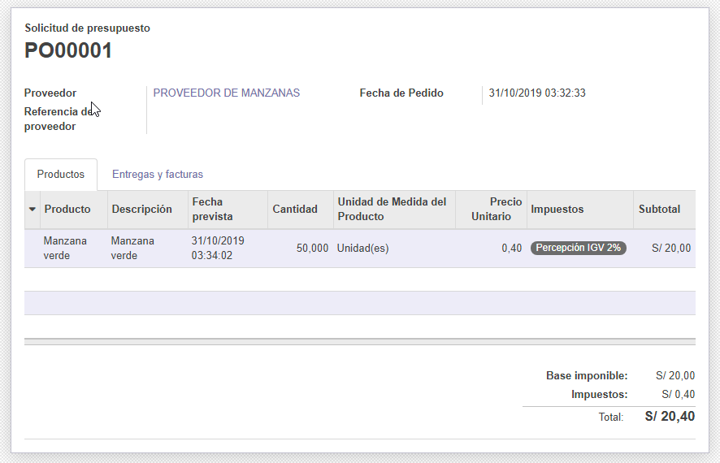

2. Verificación de que el correo enviado al proveedor fue enviado correctamente.
   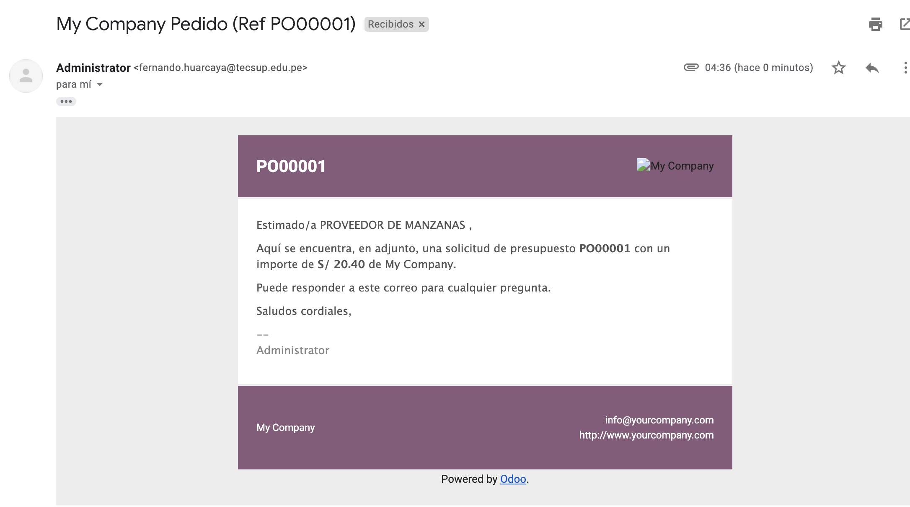

3. Observamos el formato de la solicutd de presupuesto enviado al proveedor.
   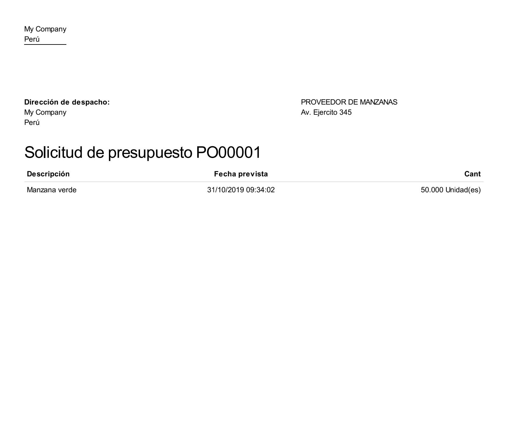

4. Pantalla al validar la solicitud del presupuesto.
   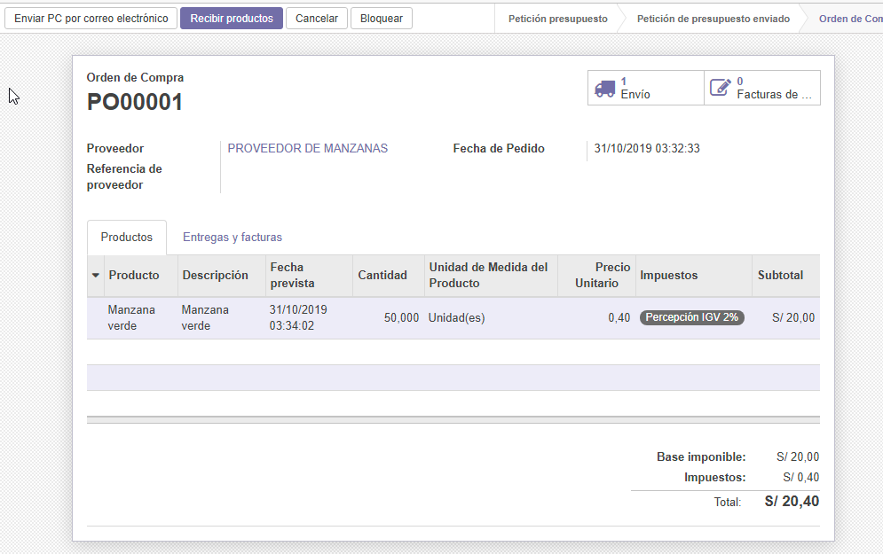

5. En mi caso no me salía **¿Crear entrega parcial?** de frente me salía este mensaje.
   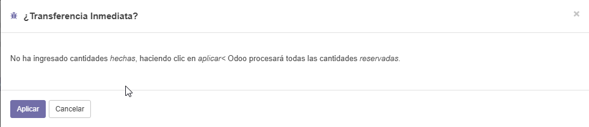

6. Factura borrador en la solicitud de presupuesto.
   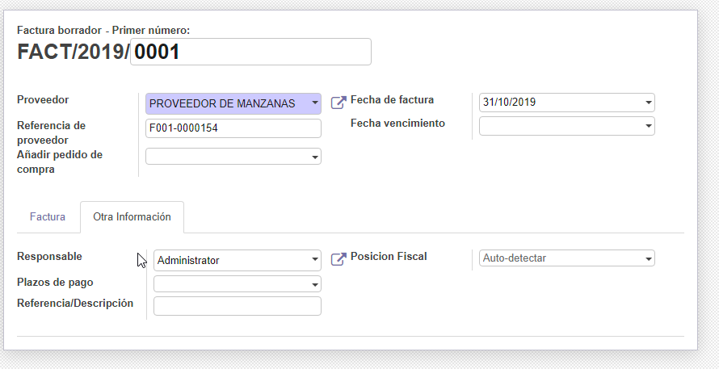

7. Verificamos que la factura para el proveedor fue creada correctamente.
   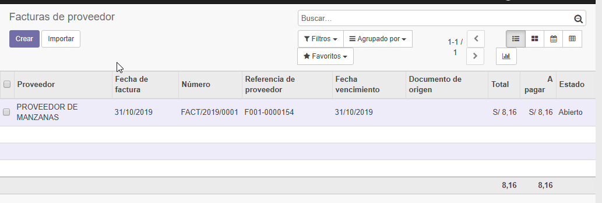

8. Verificamos que el proveedor tiene una factura y dos compras en mi caso.
   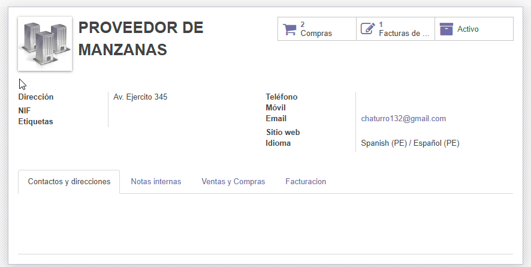

9. Creamos una cuenta bancaria.
   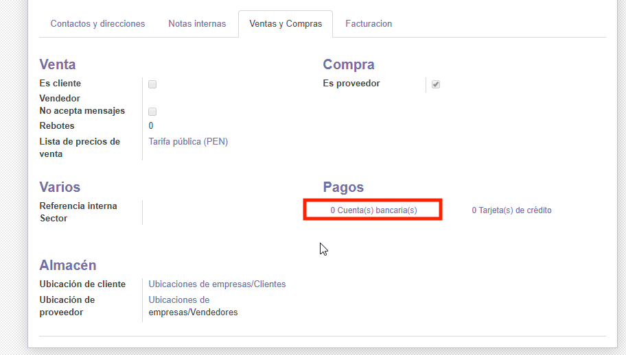

10. Llenamos los datos del banco y los demás campos.
    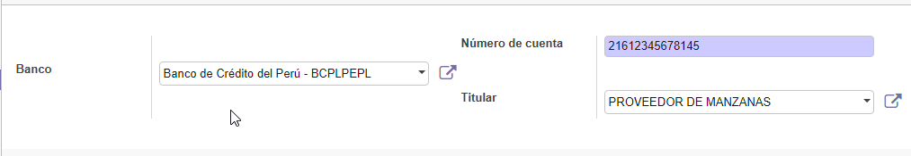

11. Verificamos que nuestra cuenta bancaria fue creada correctamente.
    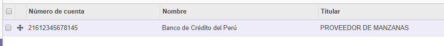

12. Pagamos la factura que teníamos pendiente.
    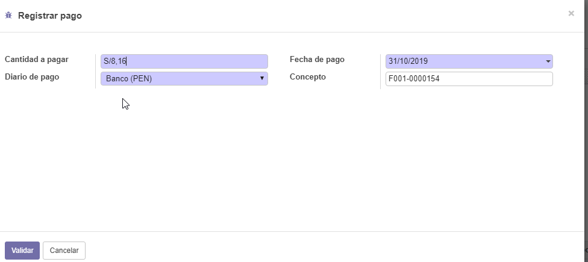

13. Verificamos que el pago se hizo correctamente.
    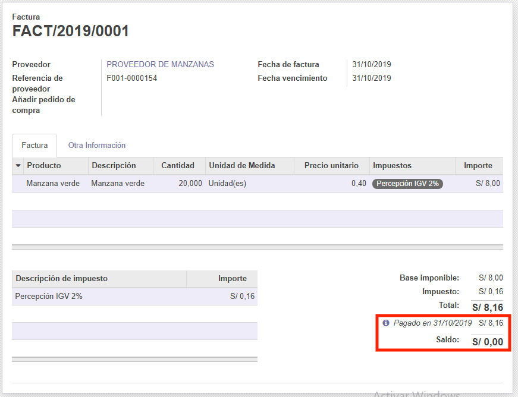

14. Vemos que en la pestaña de compras registramos a los proveedores que nos vendieron el producto seleccionado.
    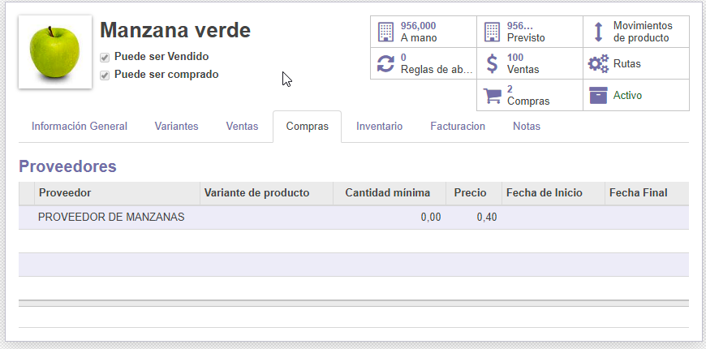

15. Tarifas de compras personalizadas por cantidades y por fechas (navidad).
    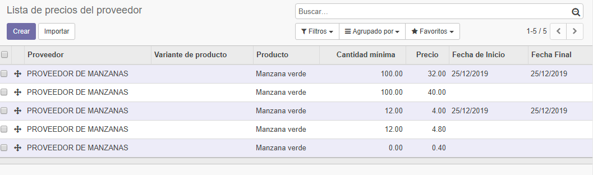

16. Creamos un acuerdo compra.
    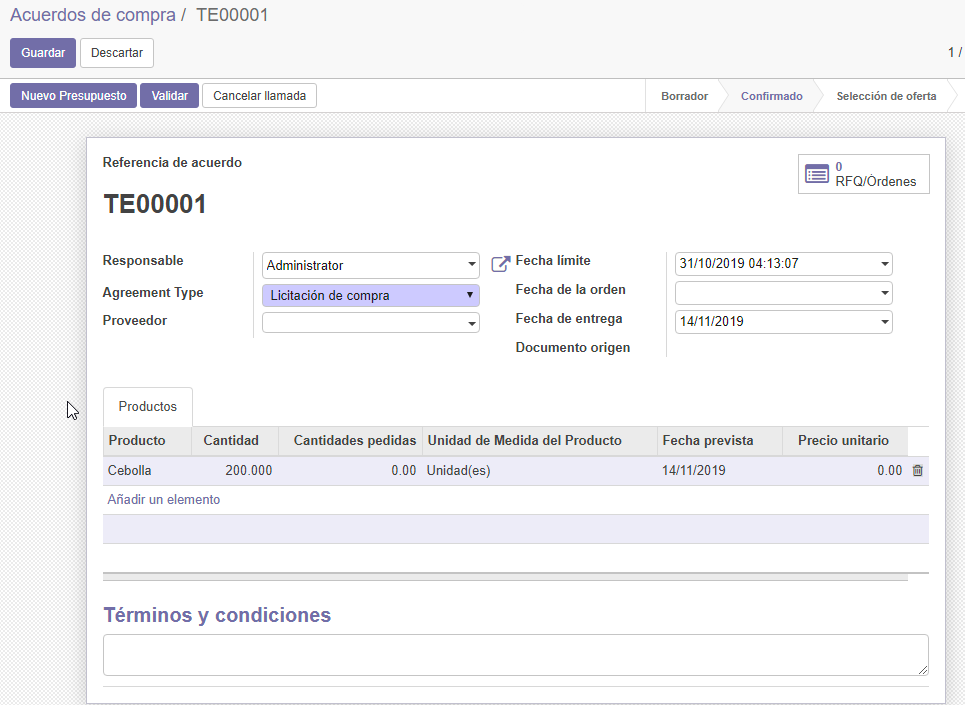

17. Observamos que tenemos dos presupuesto de diferentes proveedores.
    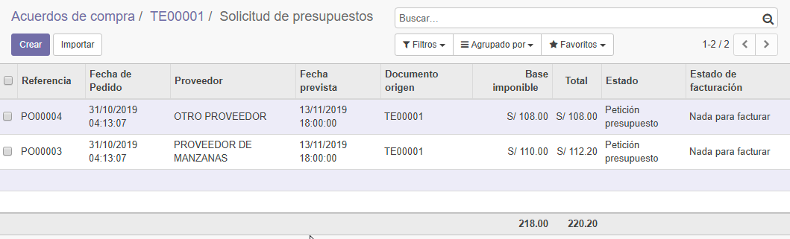

18. Facturando con el proveedor que ofreció el producto más barato.
    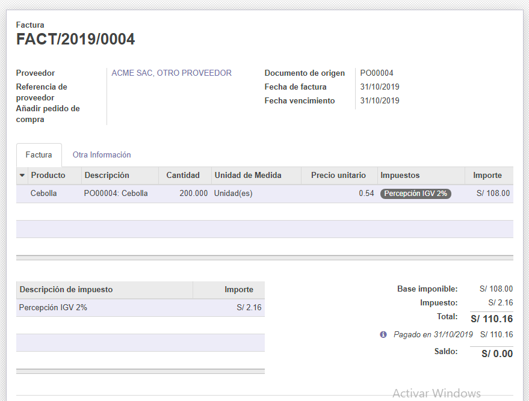

19. Vemos que facturamos ya con ese proveedor.
    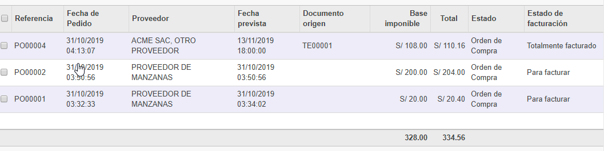

## Módulos de Terceros

20. Actualización de módulo al ya ser agregado a la carpeta seleccionada.
    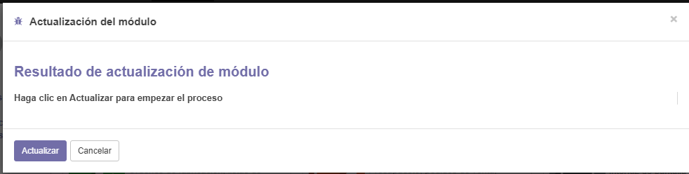

21. Intalando Módulo descargado.
    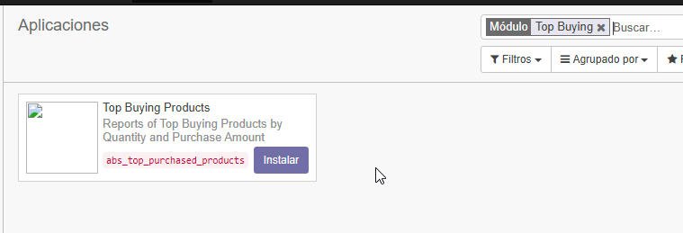

22. Este módulo nos permite hacer reportes de productos más vendidos.
    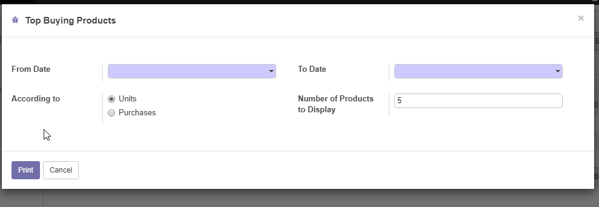

23. El módulo **Toponimos de Perú** nos sirve para llenar más rápido los campos de Provincia, Distrito y Región los cuales se pueden seleccionar una vez seleccionado el País Perú.
    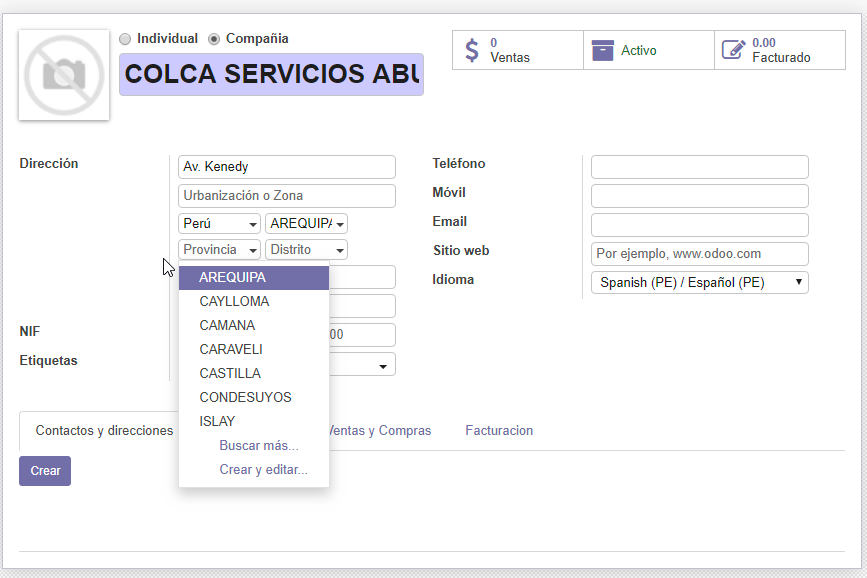
